<div align="center">

**English** · [Português](README.pt-BR.md)

<br>

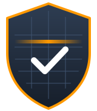

<br>

<picture>
  <source media="(prefers-color-scheme: dark)" srcset="assets/wordmark-dark.svg">
  <source media="(prefers-color-scheme: light)" srcset="assets/wordmark-light.svg">
  
</picture>

**Scans, threat models, pentests and remediation, right from the conversation.**

The AWS Security Agent power for Kiro, rebuilt as a Claude Code plugin.
One MCP server, two skills and a hook, with findings kept out of git from the first byte.

<a href="plugins/aws-security-agent/.claude-plugin/plugin.json">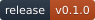</a>
<a href="LICENSE">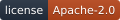</a>
<a href="https://github.com/renatofigueiredods/aws-security-agent-claude/actions/workflows/ci.yml"></a>
<a href="https://github.com/renatofigueiredods/aws-security-agent-claude/stargazers"></a>
<a href="plugins/aws-security-agent/.mcp.json"></a>
<br>


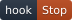
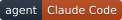
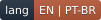

<br>

[**Install**](#install) · [**How it works**](#how-it-works) · [**Usage**](#usage) · [**Identity**](#visual-identity) · [**Contributing**](CONTRIBUTING.md)

<br>

<details>
<summary><b>&nbsp;Switch to identity option 2&nbsp;</b></summary>

<br>


<br><br>

<picture>
  <source media="(prefers-color-scheme: dark)" srcset="assets/wordmark-dark.svg">
  <source media="(prefers-color-scheme: light)" srcset="assets/wordmark-light.svg">
  
</picture>

<br><br>

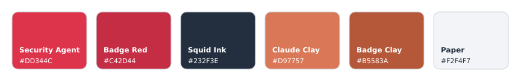

</details>

<sub>Option 1 above is the one in use. Option 2 places both marks side by side.</sub>

</div>

<br>

> [!NOTE]
> **This plugin adapts [aws-security-agent-kiro-power](https://github.com/AWS-Security-Agent/aws-security-agent-kiro-power)**
> at commit `f4c1d88`. The instructions were rewritten for Claude Code mechanics (skills,
> Stop hook, plan mode) in English and Brazilian Portuguese. The MCP server is the same
> official package, `awslabs.security-agent-mcp-server`, pinned to `0.2.1`.

> [!IMPORTANT]
> Every scan and pentest is billed to your AWS account. See
> [AWS Security Agent pricing](https://aws.amazon.com/security-agent/pricing/). The plugin
> starts a job only when you ask for it or confirm it.

<br>

---

## Why a plugin

The Kiro power bundles four pieces. Claude Code has a native equivalent for each, and a
plugin is the format that installs all four together.

| In the Kiro power | In the Claude Code plugin | What it does |
| --- | --- | --- |
| `mcp.json` | [`.mcp.json`](plugins/aws-security-agent/.mcp.json) | Starts the `security-agent` MCP through `uvx` |
| `POWER.md` | skill [`aws-security-agent`](plugins/aws-security-agent/skills/aws-security-agent/SKILL.md) | Setup, full scan, diff scan, threat model, pentest and findings presentation |
| `steering/security-agent-remediation.md` | skill [`security-agent-remediation`](plugins/aws-security-agent/skills/security-agent-remediation/SKILL.md) | Exports, triages and drives the fix of findings |
| `.kiro.hook` created at setup | [`hooks.json`](plugins/aws-security-agent/hooks/hooks.json) and [`diff-scan-suggester.sh`](plugins/aws-security-agent/hooks/diff-scan-suggester.sh) | Suggests a diff scan when a code change is finished |

Four behaviors changed on purpose in the rewrite.

| Behavior | Kiro | Claude Code | Reason |
| --- | --- | --- | --- |
| MCP version | `@latest` | `@0.2.1` | A new release runs with your AWS credentials, so upgrades go through review |
| Diff scan hook | Evaluated every turn, runs the scan without asking | Wakes the agent only on new code in an enabled project, and suggests the scan | Every scan is billed, and an extra turn in every repo costs context |
| Fixing findings | Kiro spec session | Fix plan in plan mode | Claude Code's equivalent mechanism |
| Waiting between checks | Foreground `sleep` | Background `sleep` | Claude Code blocks long foreground `sleep` |

<br>

---

## How it works

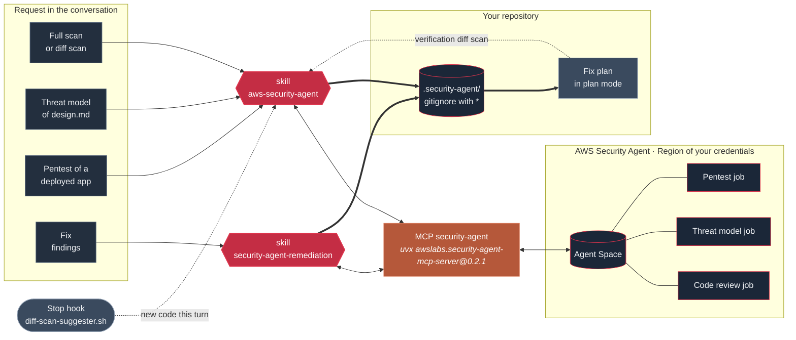

From left to right, a natural-language request activates one of the two skills, the skill
calls the MCP, and the MCP sends code and documents to AWS Security Agent in the account
and Region of your credentials. The job runs in AWS and the skill follows it to the end.
Findings come back as a chat summary and as a full report in `.security-agent/`, which
gets a `.gitignore` with `*` before anything is written, because findings carry attack
scripts and reproduction steps.

The plugin has three pieces.

1. **The MCP server.** The official `awslabs.security-agent-mcp-server` package exposes 11
   tools (`setup_check`, `setup`, `start_security_scan`, `start_diff_scan`,
   `start_threat_model_review`, `get_scan_status`, `get_scan_findings`, `list_scans`,
   `stop_scan`, `call_api`, `get_api_guide`). It keeps local state in `~/.securityagent/`.
2. **The skills.** `aws-security-agent` routes the request to the right workflow and
   follows the job every 300 s (full scan and threat model), 120 s (diff scan) or 900 s
   (pentest). `security-agent-remediation` exports findings, sorts them by risk level,
   risk score and confidence, and opens one fix plan per finding.
3. **The hook.** At the end of each turn it checks whether the project has
   `.security-agent/diff-hook` and code files changed since the last evaluation. Only then
   does it hand the turn back so the agent can decide whether the change is sensitive and
   finished.

> [!TIP]
> Without `WORKSPACE_ROOT`, the MCP only scans the directory where Claude Code was opened
> and its subdirectories. That keeps a path like `~/.aws` from being zipped and uploaded by
> mistake. To allow another directory, export `SECURITY_AGENT_WORKSPACE_ROOT` before
> opening Claude Code.

<br>

---

## Install

<div align="center">

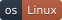


<br>

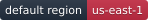
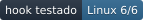

</div>

Claude Code installs the plugin straight from this repository. The marketplace ships the
same plugin in two languages, so pick one.

| Language | Plugin | Install command |
| --- | --- | --- |
| **English** (default) | `aws-security-agent` | `/plugin install aws-security-agent@aws-security-agent-claude` |
| **Português** | `aws-security-agent-pt-br` | `/plugin install aws-security-agent-pt-br@aws-security-agent-claude` |

Both bring the same MCP server and hook, so install only one. What changes per operating
system are the dependencies of the MCP (`uv`) and of the hook (`bash`, `git`, `jq`).

| | Linux | macOS | Windows |
| --- | --- | --- | --- |
| `uv` | official installer | `brew install uv` | official installer |
| Hook shell | bash | bash | Git Bash |
| Diff hash | `sha256sum` | `shasum -a 256` | Git Bash `sha256sum` |
| Status | tested | not tested | not tested |

### Pick your system

<details>
<summary>&nbsp;</summary>

<br>

**1. Install the dependencies**

```bash
curl -LsSf https://astral.sh/uv/install.sh | sh
sudo apt install jq git        # Debian, Ubuntu
sudo dnf install jq git        # Fedora, RHEL
```

**2. Sign in to AWS**

Credentials come from the environment Claude Code is opened in.

```bash
aws sso login --profile <your-profile>
export AWS_PROFILE=<your-profile>
export AWS_REGION=us-east-1    # optional, this is the default
```

**3. Install the plugin**

Inside Claude Code.

```
/plugin marketplace add renatofigueiredods/aws-security-agent-claude
/plugin install aws-security-agent@aws-security-agent-claude
```

Restart the session so the `security-agent` MCP starts.

**4. Check**

```
/mcp
```

The `security-agent` server shows as connected. Then ask for setup in the conversation,
for example *"set up the security agent"*.

</details>

<details>
<summary>&nbsp;</summary>

<br>

**1. Install the dependencies**

```bash
brew install uv jq git
```

**2. Sign in to AWS**

```bash
aws sso login --profile <your-profile>
export AWS_PROFILE=<your-profile>
```

**3. Install the plugin**

```
/plugin marketplace add renatofigueiredods/aws-security-agent-claude
/plugin install aws-security-agent@aws-security-agent-claude
```

**4. Check**

```
/mcp
```

> [!NOTE]
> macOS does not ship `sha256sum`, so the hook falls back to `shasum -a 256`. Not yet
> validated on macOS.

</details>

<details>
<summary>&nbsp;</summary>

<br>

**1. Install the dependencies**

```powershell
powershell -ExecutionPolicy ByPass -c "irm https://astral.sh/uv/install.ps1 | iex"
winget install Git.Git
winget install jqlang.jq
```

**2. Sign in to AWS**

```powershell
aws sso login --profile <your-profile>
$env:AWS_PROFILE = "<your-profile>"
```

**3. Install the plugin**

```
/plugin marketplace add renatofigueiredods/aws-security-agent-claude
/plugin install aws-security-agent@aws-security-agent-claude
```

**4. Check**

```
/mcp
```

> [!NOTE]
> The hook is a bash script and relies on Git Bash. Not yet validated on Windows.

</details>

> [!IMPORTANT]
> The `.gitignore` with `*` inside `.security-agent/` keeps findings out of the repository.
> Also make sure the root `.gitignore` does not force that directory back in, because the
> report contains working attack scripts and sometimes leaked secrets.

<br>

---

## Usage

You talk, the skill picks the workflow.

```
> set up the security agent
> run a diff scan on my changes before the PR
> run a full scan of the repository
> run the threat model on requirements.md and design.md
> pentest the staging application
> how is the scan going?
> pull the findings from the last pentest and help me fix them
```

To turn off the automatic diff scan suggestion in a project, delete
`.security-agent/diff-hook`.

<br>

---

## Popularity

<div align="center">

<a href="https://star-history.com/#renatofigueiredods/aws-security-agent-claude&Date">
<picture>
  <source media="(prefers-color-scheme: dark)" srcset="https://api.star-history.com/svg?repos=renatofigueiredods/aws-security-agent-claude&type=Date&theme=dark">
  <source media="(prefers-color-scheme: light)" srcset="https://api.star-history.com/svg?repos=renatofigueiredods/aws-security-agent-claude&type=Date">
  
</picture>
</a>

</div>

<br>

---

## Core conventions

| Rule | Why |
| --- | --- |
| Findings only in `.security-agent/`, with the `.gitignore` created first | Findings carry attack scripts, reproduction steps and sometimes secrets |
| In chat, only title, count and one impact line | Exploit detail stays in the file, out of the conversation history |
| A job starts only on request or confirmation | Every scan and pentest is billed to the AWS account |
| `HIGH` and `MEDIUM` confidence by default | Lower bands are noisier, and widening is on request |
| Triage sorted by risk level, risk score and confidence | Deterministic order, no eyeballing |
| One fix plan per finding or per root cause | Each security fix stays reviewable on its own |
| Pinned MCP version | Upgrading means bumping the version in `.mcp.json` after reading the package changelog |

<br>

---

## Visual identity

<div align="center">


</div>

The logo pairs the official AWS Architecture Icon for AWS Security Agent, in the lead, with
the Claude mark in the corner, so neither identity is lost. The palette comes straight from
both marks, the Security Agent red and the Claude clay, over AWS Squid Ink. The badges
reuse the same colors, red for plugin data and clay for platform.

<br>

---

## Roadmap

- [x] MCP, skills and hook rewritten from power `f4c1d88`
- [x] English and Brazilian Portuguese plugins in the same marketplace
- [x] CI validating manifests, hook behavior in both plugins and the 11 MCP tools of `0.2.1`
- [ ] Validate install and hook on macOS
- [ ] Validate install and hook on Windows with Git Bash
- [ ] Track new releases of `awslabs.security-agent-mcp-server` and of the original power

<br>

---

## Contributing

Read [`CONTRIBUTING.md`](CONTRIBUTING.md). In short, branch from `main`, keep both plugins
in sync (the hook script is identical in both, and CI checks it) and run
`bash tests/hook-test.sh` before opening a PR.

For security issues, follow [`SECURITY.md`](SECURITY.md) and report privately rather than
opening a public issue.

<br>

---

<div align="center">


**AWS Security Agent for Claude Code** · adapted by [DreamSquad](https://dreamsquad.com.br)

Distributed under the [Apache License 2.0](LICENSE).

<sub>AWS, AWS Security Agent and the AWS Architecture Icons are trademarks of Amazon.com, Inc. or its affiliates.
Claude and Claude Code are trademarks of Anthropic, PBC. This project is not affiliated with or endorsed by either company.</sub>

</div>
