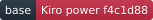
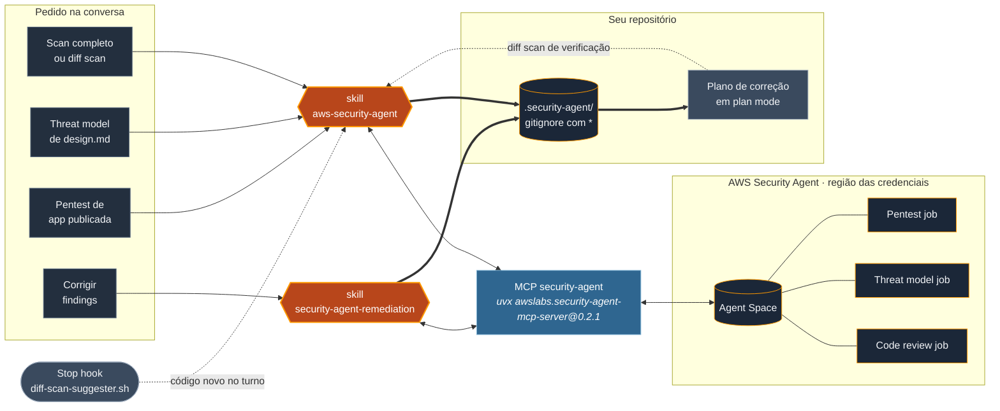

<div align="center">


<br>

<picture>
  <source media="(prefers-color-scheme: dark)" srcset="assets/wordmark-dark.svg">
  <source media="(prefers-color-scheme: light)" srcset="assets/wordmark-light.svg">
  
</picture>

**Scan, threat model, pentest e remediação, direto da conversa.**

O power do AWS Security Agent para Kiro, reescrito como plugin do Claude Code.
Um MCP server, duas skills e um hook, com os findings fora do git desde o primeiro byte.

<a href="plugins/aws-security-agent/.claude-plugin/plugin.json"></a>
<a href="plugins/aws-security-agent/LICENSE"></a>
<a href="plugins/aws-security-agent/.mcp.json"></a>
<a href="https://github.com/AWS-Security-Agent/aws-security-agent-kiro-power/tree/f4c1d88"></a>
<br>


<br>

[**Instalação**](#instalação) · [**Como funciona**](#como-funciona) · [**Uso**](#uso) · [**Convenções**](#convenções-essenciais) · [**Licença**](#licença)

</div>

<br>

> [!NOTE]
> **Este plugin é uma adaptação do [aws-security-agent-kiro-power](https://github.com/AWS-Security-Agent/aws-security-agent-kiro-power)**
> no commit `f4c1d88`. As instruções foram traduzidas para português e reescritas para os
> mecanismos do Claude Code (skills, Stop hook, plan mode). O MCP server é o mesmo pacote
> oficial `awslabs.security-agent-mcp-server`, fixado na versão `0.2.1`.

> [!IMPORTANT]
> Cada scan e cada pentest gera cobrança na sua conta AWS. Consulte o
> [pricing do AWS Security Agent](https://aws.amazon.com/security-agent/pricing/). O plugin
> só inicia um job quando você pede ou confirma.

<br>

---

## Por que um plugin

O power do Kiro junta quatro coisas num pacote só. O Claude Code tem um equivalente nativo
para cada uma, e o plugin é o formato que instala as quatro juntas.

| No power do Kiro | No plugin do Claude Code | O que faz |
| --- | --- | --- |
| `mcp.json` | [`.mcp.json`](plugins/aws-security-agent/.mcp.json) | Sobe o MCP `security-agent` via `uvx` |
| `POWER.md` | skill [`aws-security-agent`](plugins/aws-security-agent/skills/aws-security-agent/SKILL.md) | Setup, scan completo, diff scan, threat model, pentest e apresentação dos findings |
| `steering/security-agent-remediation.md` | skill [`security-agent-remediation`](plugins/aws-security-agent/skills/security-agent-remediation/SKILL.md) | Exporta, tria e conduz a correção dos findings |
| hook `.kiro.hook` criado no setup | [`hooks.json`](plugins/aws-security-agent/hooks/hooks.json) e [`diff-scan-suggester.sh`](plugins/aws-security-agent/hooks/diff-scan-suggester.sh) | Sugere diff scan quando uma mudança de código termina |

Na tradução, quatro comportamentos mudaram de propósito.

| Comportamento | Kiro | Claude Code | Motivo |
| --- | --- | --- | --- |
| Versão do MCP | `@latest` | `@0.2.1` | Uma versão nova roda com a sua credencial AWS, então a atualização passa por revisão |
| Hook de diff scan | Avaliado em todo turno, roda o scan sem perguntar | Só acorda o agente com código novo em projeto ativado, e sugere o scan | Cada scan é cobrado, e um turno extra em todo repo custa contexto |
| Correção de findings | Spec session do Kiro | Plano de correção em plan mode | Mecanismo equivalente do Claude Code |
| Espera entre consultas | `sleep` em primeiro plano | `sleep` em background | O Claude Code bloqueia `sleep` longo em primeiro plano |

<br>

---

## Como funciona



Da esquerda para a direita, o pedido em linguagem natural ativa uma das duas skills, a
skill chama o MCP, e o MCP envia código e documentos para o AWS Security Agent na conta e
região das suas credenciais. O job roda na AWS e a skill acompanha até o fim. Os findings
voltam como resumo no chat e como relatório completo em `.security-agent/`, que recebe um
`.gitignore` com `*` antes de qualquer escrita, porque finding traz script de ataque e
passos de reprodução.

O plugin tem três peças.

1. **O MCP server.** O pacote oficial `awslabs.security-agent-mcp-server` expõe 11
   ferramentas (`setup_check`, `setup`, `start_security_scan`, `start_diff_scan`,
   `start_threat_model_review`, `get_scan_status`, `get_scan_findings`, `list_scans`,
   `stop_scan`, `call_api`, `get_api_guide`). Ele guarda estado local em
   `~/.securityagent/`.
2. **As skills.** `aws-security-agent` roteia o pedido para o workflow certo e acompanha
   o job com intervalo de 300 s (scan completo e threat model), 120 s (diff scan) ou
   900 s (pentest). `security-agent-remediation` exporta os findings, ordena por risk
   level, risk score e confiança, e abre um plano de correção por finding.
3. **O hook.** Ao fim de cada turno, verifica se o projeto tem `.security-agent/diff-hook`
   e arquivos de código alterados desde a última avaliação. Só nesse caso devolve o turno
   ao agente para decidir se a mudança é sensível e está concluída.

> [!TIP]
> Sem `WORKSPACE_ROOT`, o MCP só aceita escanear o diretório onde o Claude Code foi aberto
> e seus subdiretórios. Isso impede que um caminho como `~/.aws` seja compactado e enviado
> por engano. Para liberar outro diretório, exporte `SECURITY_AGENT_WORKSPACE_ROOT` antes
> de abrir o Claude Code.

<br>

---

## Instalação

<div align="center">


<br>


</div>

O plugin é instalado pelo próprio Claude Code a partir deste repositório. O que muda por
sistema são as dependências do MCP (`uv`) e do hook (`bash`, `git`, `jq`).

| | Linux | macOS | Windows |
| --- | --- | --- | --- |
| `uv` | instalador oficial | `brew install uv` | instalador oficial |
| Shell do hook | bash | bash | Git Bash |
| Hash do diff | `sha256sum` | `shasum -a 256` | `sha256sum` do Git Bash |
| Status | testado | não testado | não testado |

### Escolha o seu sistema

<details>
<summary>&nbsp;</summary>

<br>

**1. Instale as dependências**

```bash
curl -LsSf https://astral.sh/uv/install.sh | sh
sudo apt install jq git        # Debian, Ubuntu
sudo dnf install jq git        # Fedora, RHEL
```

**2. Autentique na AWS**

As credenciais vêm do ambiente em que o Claude Code é aberto.

```bash
aws sso login --profile <seu-profile>
export AWS_PROFILE=<seu-profile>
export AWS_REGION=us-east-1    # opcional, este é o padrão
```

**3. Instale o plugin**

Dentro do Claude Code.

```
/plugin marketplace add renatofigueiredods/aws-security-agent-claude
/plugin install aws-security-agent@aws-security-agent-claude
```

Reinicie a sessão para o MCP `security-agent` subir.

**4. Confira**

```
/mcp
```

O servidor `security-agent` aparece conectado. Depois peça o setup na conversa, por
exemplo *"faz o setup do security agent"*.

</details>

<details>
<summary>&nbsp;</summary>

<br>

**1. Instale as dependências**

```bash
brew install uv jq git
```

**2. Autentique na AWS**

```bash
aws sso login --profile <seu-profile>
export AWS_PROFILE=<seu-profile>
```

**3. Instale o plugin**

```
/plugin marketplace add renatofigueiredods/aws-security-agent-claude
/plugin install aws-security-agent@aws-security-agent-claude
```

**4. Confira**

```
/mcp
```

> [!NOTE]
> O macOS não traz `sha256sum`, e o hook usa `shasum -a 256` nesse caso. Ainda não foi
> validado em macOS.

</details>

<details>
<summary>&nbsp;</summary>

<br>

**1. Instale as dependências**

```powershell
powershell -ExecutionPolicy ByPass -c "irm https://astral.sh/uv/install.ps1 | iex"
winget install Git.Git
winget install jqlang.jq
```

**2. Autentique na AWS**

```powershell
aws sso login --profile <seu-profile>
$env:AWS_PROFILE = "<seu-profile>"
```

**3. Instale o plugin**

```
/plugin marketplace add renatofigueiredods/aws-security-agent-claude
/plugin install aws-security-agent@aws-security-agent-claude
```

**4. Confira**

```
/mcp
```

> [!NOTE]
> O hook é um script bash e depende do Git Bash. Ainda não foi validado em Windows.

</details>

> [!IMPORTANT]
> O `.gitignore` com `*` dentro de `.security-agent/` impede que os findings entrem no
> repositório. Confirme também que o `.gitignore` da raiz não força a inclusão desse
> diretório, porque o relatório contém script de ataque funcional e às vezes segredo vazado.

<br>

---

## Uso

Você conversa, a skill escolhe o workflow.

```
> faz o setup do security agent
> roda um diff scan das minhas mudanças antes do PR
> faz um scan completo do repositório
> roda o threat model no requirements.md e no design.md
> faz um pentest na aplicação de homologação
> como está o scan?
> traz os findings do último pentest e me ajuda a corrigir
```

Para desligar a sugestão automática de diff scan num projeto, apague
`.security-agent/diff-hook`.

<br>

---

## Convenções essenciais

| Regra | Por quê |
| --- | --- |
| Findings só em `.security-agent/`, com `.gitignore` criado antes | Finding traz script de ataque, passos de reprodução e às vezes segredo |
| No chat, só título, contagem e uma linha de impacto | O detalhe de exploração fica no arquivo, fora do histórico da conversa |
| Job só começa com pedido ou confirmação | Cada scan e pentest é cobrado na conta AWS |
| Confiança `HIGH` e `MEDIUM` por padrão | As faixas abaixo trazem mais ruído, e ampliar fica a pedido |
| Ordem de triagem por risk level, risk score e confiança | Ordenação determinística, sem depender de leitura a olho |
| Um plano de correção por finding ou por causa raiz | Cada correção de segurança fica revisável isoladamente |
| MCP com versão fixa | Atualizar é trocar a versão no `.mcp.json` depois de ler o changelog do pacote |

<br>

---

## Roadmap

- [x] MCP, skills e hook traduzidos do power `f4c1d88`
- [x] MCP `0.2.1` validado por handshake, com as 11 ferramentas listadas
- [x] Hook validado em Linux nos 6 cenários (sem marcador, código novo, diff repetido, stop hook ativo, código alterado, só documentação)
- [ ] Validar instalação e hook em macOS
- [ ] Validar instalação e hook em Windows com Git Bash
- [ ] Acompanhar novas versões do `awslabs.security-agent-mcp-server` e do power original

<br>

---

## Licença

Distribuído sob a [Apache License 2.0](plugins/aws-security-agent/LICENSE). O
[`NOTICE`](plugins/aws-security-agent/NOTICE) registra a origem no power da AWS e as
modificações feitas.

<br>

---

<div align="center">


**AWS Security Agent para Claude Code** · adaptado pela [DreamSquad](https://dreamsquad.com.br)

AWS e AWS Security Agent são marcas da Amazon.com, Inc. Este projeto não é oficial da AWS.

</div>
